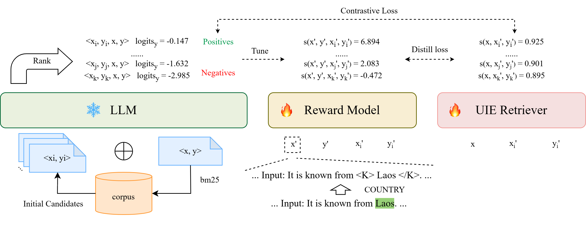

# RUIE
Code for COLING 2025 paper "RUIE: Retrieval-based Unified Information Extraction using Large Language Model"



## Environment

```bash
conda create -n ruie python=3.10
conda activate ruie
python -m pip install -r requirements.txt
```

## Datasets

We mainly use [IE INSTRUCTION](https://github.com/BeyonderXX/InstructUIE), [RAMS](https://nlp.jhu.edu/rams/), [Wikievents](https://github.com/raspberryice/gen-arg) and [CrudeOilNews](https://github.com/meisin/CrudeOilNews-Corpus) to construct our training data and test data. The processed dataset will be published soon.

## Training & Evaluation

1. Use bm25 to initialize candidates for training samples

```bash
bash scripts/bm25_search.sh
```

2. Scoring candidates using LLM:

```bash
bash scripts/gen_llm_score.sh
```

3. Keyword augmented reward model training (Due to [#6571](https://github.com/deepspeedai/DeepSpeed/issues/6571), [#2736](https://github.com/deepspeedai/DeepSpeed/issues/2736) and [#94907](https://github.com/pytorch/pytorch/issues/94907), this step may require manually downgrading transformers to version 4.42.4)

```bash
OUTPUT_DIR=outputs/keyword_reward_model bash scripts/train_reward.sh
```

4. Generating reward scores

```bash
OUTPUT_DIR=data bash scripts/gen_reward_scores.sh outputs/keyword_reward_model
```

5. UIE retriever training

```bash
OUTPUT_DIR=outputs/uie_retriever bash scripts/train_kd_biencoder.sh
```

6. Information extraction with UIE retriever (Due to only vllm>=0.5.4 supports llama3.1 and vllm >=0.5.4 need newer transformers, so this step must upgrade transformers to newest version.)

```bash
OUTPUT_DIR=outputs/uie_retriever bash scripts/scripts/eval_retriever.sh outputs/uie_retriever
```

7. Evaluating F1-score per task (take NER as example)

```bash
python src/evaluation/calculate_f1.py --prediction-dir outputs/Llama-3.1-8B-Instruct/k8/NER --task NER
```

## Citation

If you find that the code is useful in your research, please consider citing our paper.

```
@inproceedings{liao-etal-2025-ruie,
    title = "{RUIE}: Retrieval-based Unified Information Extraction using Large Language Model",
    author = "Liao, Xincheng and Duan, Junwen and Huang, Yixi and Wang, Jianxin",
    booktitle = "Proceedings of the 31st International Conference on Computational Linguistics",
    month = jan,
    year = "2025",
    address = "Abu Dhabi, UAE",
    publisher = "Association for Computational Linguistics",
    url = "https://aclanthology.org/2025.coling-main.645/",
    pages = "9640--9655",
}
```

## Contact

If you have any question, please create an issue or contact Xincheng Liao at ([ostars@csu.edu.cn](mailto:ostars@csu.edu.cn))